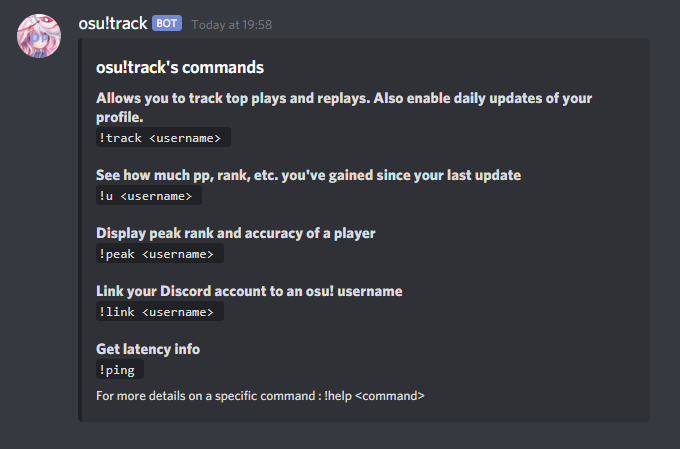

# osu!track bot

osu!track is a bot focused on the rythm game osu! It tracks things and do things.


## Bot documentation

### Commands


`!help <?command>` - Displays a list of commands



`!peak <?username>` - Display peak rank and accuracy of a player


`!u <?username>` - Update an osu! profile via [osu!track](https://ameobea.me/osutrack/)


`!link <?username>` - Link your Discord profile to an osu! profile, so you can just type `!u` and `!peak` for example


### Tracking

#### Mass update

Tracked players are queued for an automatic [osu!track](https://ameobea.me/osutrack/) update. (Once a day)


#### ~~Top plays tracking~~

## Installation

Have [Node.js](https://nodejs.org/) (version 14.8.x or newer) installed.

```bash
npm install
```

Then copy the `.env.example` to `.env` and fill in the values.

To run the bot in development mode run :

```bash
npm run dev
```

To  run the bot in production mode run :

```bash
npm run start
```

## Directory structure

### `src/commands`

Commands are classes that exports a `run` method and several properties.

```js
class Command {
  name = 'command-name' // !command-name
  arguments = ['username'] // Accepted arguments for the command !command-name <username>
  description = 'Description of the command' // Used for the !help command
  category = 'general'

  async run (message, args) {}
}
```

### `src/services`

Services needs to export a function that triggers the service (running a cron job, etc)

### `src/Bot.js`

The `Bot.js` file is used for the internal logic of the bot.
We'll add listeners to the bot's events and handle the commands.

<p align="center">
  
</p>

## Credits

### Services
- [https://ameobea.me/osutrack/](https://ameobea.me/osutrack/) osutrack is a statistics tracker for the game osu!. It stores user information in a database and creates graphs and displays statistics showing how that users' stats changed over time.. A project by [ameobea](https://ameobea.me/)
- [o!rdr](https://ordr.issou.best/) o!rdr is a free online tool to make renders of osu! replays using [Danser](https://github.com/Wieku/danser-go). Made by [MasterIO](https://github.com/MasterIO02/)
- [https://lemmmy.pw/osusig/](https://lemmmy.pw/osusig/) for the `!osu` profile image. Created by [Lemmmy](https://osu.ppy.sh/users/4656511)

### Art
- [AKARA](https://akara.fr/) Thank you for the art ! (Badges cover of the `!peak` command)
- [Bouf](https://osu.ppy.sh/users/4431069) for the edit of Koigokoro avatar

## License
[MIT](./LICENSE)