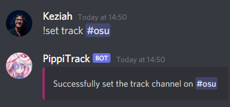

# PippiTrack

A Discord bot that allows you to track osu! things. It has some useful commands too.

## [Invite PippiTrack to your server](https://discord.com/oauth2/authorize?client_id=862374917206048779&scope=bot&permissions=388160)

Please report any issues by contacting me on Discord (**Keziah#6631**) or by creating an issue on this repository.

## How to use this bot ?

### Get started

#### For administrators

After inviting the bot to your server, you need to configure it a bit :

##### Enable tracking

To enable tracking you need to set the channels for each type of tracking.

Type `!set track #channel` if you want to enable auto updates ~~and top plays (WIP)~~



Type `!set replay #channel` if you want to enable replays tracking.

> Note: if you don't mention a channel it will use the current channel

##### Enable tracking requests

Type `!set admin #channel` to enable tracking requests. #channel must be a **private** channel that only moderators can access otherwise anyone can accept the requests.

By default users can track themselves (will probably change in the near future) so it allows you to control who can be tracked on your server.


> Note: There is a limit of 100 tracked users per server.

##### Set the bot's prefix

Type `!set prefix <new prefix>` to change the bot's prefix.

##### Show a list of tracked users

Type `!tracklist <?page>` to show a list of tracked users.

If you have more than 25 tracked users you can type `!tracklist 2` to show the second page.


##### Untrack a user

There is 2 ways to untrack a user :


> Note: You can mention the user to untrack or use the osu! username.

#### For users

Start by linking your Discord account to an osu! username like so :

`!link <osu! username>`


Once it's done you can use commands without specifying a username. (like `!u`)

### List of commands

`!u <?username>` - Update an osu! profile via [osu!track](https://ameobea.me/osutrack/)


`!peak <?username>` - Display peak rank and accuracy of a player


`!osu <?username>` - Display your profile stats via [osu!sig](https://lemmmy.pw/osusig/)


`!help` - Send a link to this page

### Tracking

#### Top plays

_This feature is currently under development_

#### Updates

Tracked players are queued for an automatic [osu!track](https://ameobea.me/osutrack/) update. (Once a day)


#### Replays (o!rdr)

Tracked players that use [o!rdr](https://ordr.issou.best/) will have their replays sent in the replay channel. (if set)


## Installation

Have [Node.js](https://nodejs.org/) (version 14.8.x or newer) installed.

```bash
npm install
```

Then copy the `.env.example` to `.env` and fill in the values.

To run the bot in development mode run :

```bash
npm run dev
```

To run the bot in production mode run :

```bash
npm run build && npm run start
```

## Directory structure

### `src/commands`

Commands are classes that exports a `run` method and several properties.

```js
class Command {
  name = 'command-name' // !command-name
  arguments = ['username'] // Accepted arguments for the command !command-name <username>
  description = 'Description of the command' // Used for the !help command
  category = 'general'

  async run(message, args) {}
}
```

### `src/services`

Services needs to export a function that triggers the service (running a cron job, etc)

### `src/Bot.js`

The `Bot.js` file is used for the internal logic of the bot.
We'll add listeners to the bot's events and handle the commands.

## Credits

### Services

- [https://ameobea.me/osutrack/](https://ameobea.me/osutrack/) osutrack is a statistics tracker for the game osu!. It stores user information in a database and creates graphs and displays statistics showing how that users' stats changed over time.. A project by [ameobea](https://ameobea.me/)
- [o!rdr](https://ordr.issou.best/) o!rdr is a free online tool to make renders of osu! replays using [Danser](https://github.com/Wieku/danser-go). Made by [MasterIO](https://github.com/MasterIO02/)
- [https://lemmmy.pw/osusig/](https://lemmmy.pw/osusig/) for the `!osu` profile image. Created by [Lemmmy](https://osu.ppy.sh/users/4656511)

### Art

- [AKARA](https://akara.fr/) Thank you for the art ! (Badges cover of the `!peak` command)
- [Bouf](https://osu.ppy.sh/users/4431069) for the edit of Koigokoro avatar

## License

[MIT](./LICENSE)
