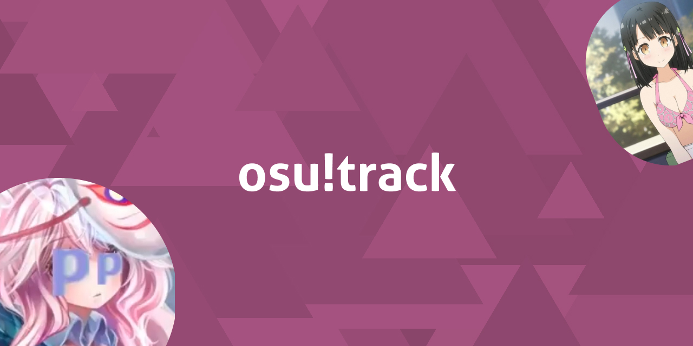


# PippiTrack

A Discord bot that allows you to track osu! things. It has some useful commands too.

## [Invite PippiTrack to your server](https://discord.com/oauth2/authorize?client_id=862374917206048779&permissions=137439078464&scope=bot%20applications.commands)

## How do I report a bug or request a feature ?

- [Join the PippiTrack Discord server](https://discord.gg/bNQUZeHFdR)
- [Create an issue](https://github.com/KeziahMoselle/pippi-track/issues/new) on this repository.
- Contact me on Discord (**Keziah#6631**)

## How do I use PippiTrack ?

### See documentation at [https://pippitrack.com/](https://pippitrack.com/)

### Get started

#### For users

Start by linking your Discord account to an osu! username like so :

```
!link <osu! username>
```

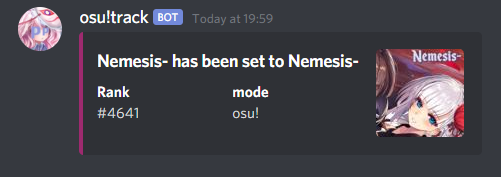

Once it's done you can use commands without specifying a username. (like `!u`)

[See all commands](#list-of-commands)

#### For administrators

After inviting the bot to your server, you need to configure it or else it won't track anything !

Type the following and follow the instructions :

```
!config
```

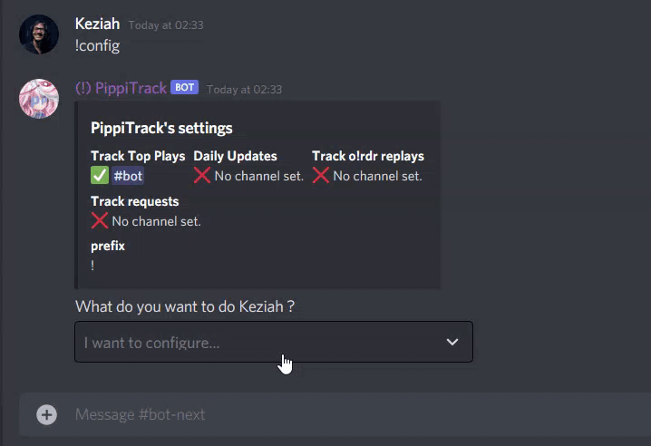

<details>
  <summary>Click to expand - More administrator info</summary>

  <h5 id="enable-tracking-requests">Tracking requests</h5>
  <p>#channel must be a <strong>private</strong> channel that only moderators can access otherwise anyone can accept the requests.</p>
  <p>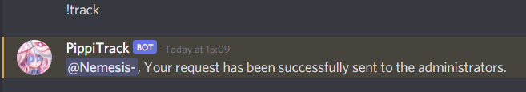
  
  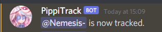</p>
  <blockquote>
  <p>Note: There is a limit of 100 tracked users per server.</p>
  </blockquote>
  <h5 id="show-a-list-of-tracked-users">Show a list of tracked users</h5>
  <p>Type <code>!tracklist &lt;?page&gt;</code> to show a list of tracked users.</p>
  <p>If you have more than 25 tracked users you can type <code>!tracklist 2</code> to show the second page.</p>
  <p>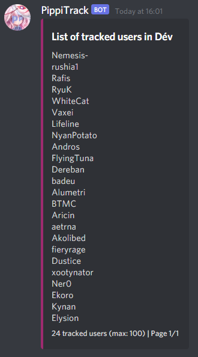</p>
  <h5 id="untrack-a-user">Untrack a user</h5>
  <p>There is 3 ways to untrack a user :</p>
  <p></p>
  <p>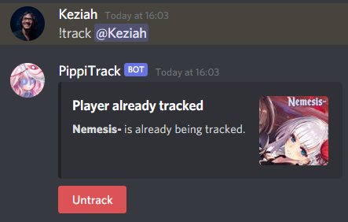</p>
  <p>Untrack all users at once :</p>
  <p>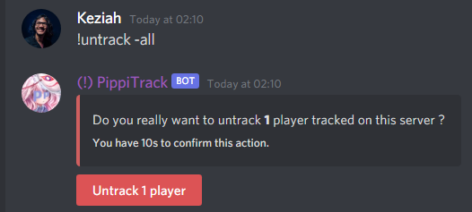</p>
  <blockquote>
    <p>Note: You can mention the user to untrack or use the osu! username.</p>
  </blockquote>

</details>

### List of commands

Track a user (top plays, daily updates and replays)

```
!track <?username>
```

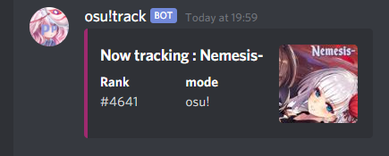

Update an osu! profile via [osu!track](https://ameobea.me/osutrack/)

```
!u <?username>
```

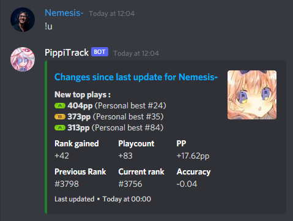

Display peak rank and accuracy of a player

```
!peak <?username>
```

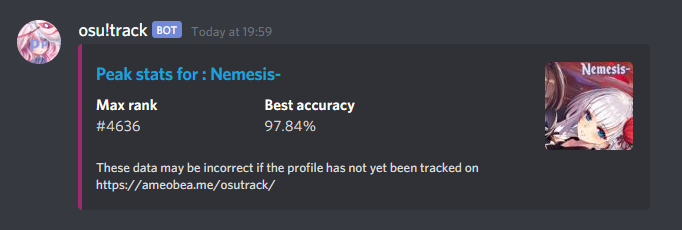

Display your profile stats via [osu!sig](https://lemmmy.pw/osusig/)

```
!osu <?username>
```

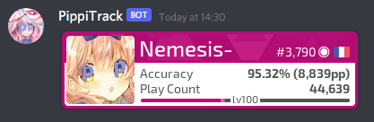

Send a link to this page

```
!help
```

### Tracking

#### Top plays (Need polish)

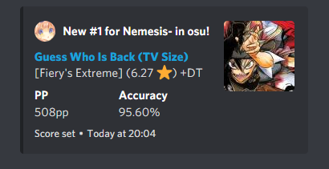

#### Updates

Tracked players are queued for an automatic [osu!track](https://ameobea.me/osutrack/) update. (Once a day)

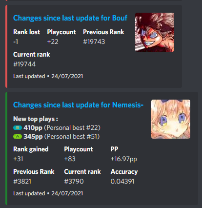

#### Replays (o!rdr)

Tracked players that use [o!rdr](https://ordr.issou.best/) will have their replays sent in the replay channel. (if set)

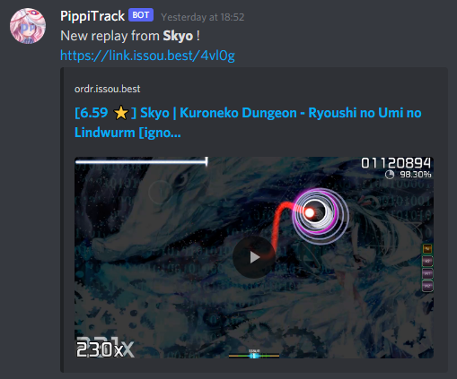

## Installation

Have [Node.js](https://nodejs.org/) (version 14.8.x or newer) installed.

```bash
npm install
```

Then copy the `.env.example` to `.env` and fill in the values.

To run the bot in development mode run :

```bash
npm run dev
```

To run the bot in production mode run :

```bash
npm run build && npm run start
```

## Directory structure

### `src/commands`

Commands are classes that exports a `run` method and several properties.

```js
class Command {
  name = 'command-name' // !command-name
  arguments = ['username'] // Accepted arguments for the command !command-name <username>
  description = 'Description of the command' // Used for the !help command
  category = 'general'

  async run(message, args) {}
}
```

### `src/services`

Services needs to export a function that triggers the service (running a cron job, etc)

### `src/Bot.js`

The `Bot.js` file is used for the internal logic of the bot.
We'll add listeners to the bot's events and handle the commands.

## Credits

### Services

- [https://ameobea.me/osutrack/](https://ameobea.me/osutrack/) osutrack is a statistics tracker for the game osu!. It stores user information in a database and creates graphs and displays statistics showing how that users' stats changed over time.. A project by [ameobea](https://ameobea.me/)
- [o!rdr](https://ordr.issou.best/) o!rdr is a free online tool to make renders of osu! replays using [Danser](https://github.com/Wieku/danser-go). Made by [MasterIO](https://github.com/MasterIO02/)
- [https://lemmmy.pw/osusig/](https://lemmmy.pw/osusig/) for the `!osu` profile image. Created by [Lemmmy](https://osu.ppy.sh/users/4656511)

### Art

- [AKARA](https://akara.fr/) Thank you for the art ! (Badges cover of the `!peak` command)
- [Bouf](https://osu.ppy.sh/users/4431069) for the name `PippiTrack` and the edit of Koigokoro avatar !

## License

[MIT](./LICENSE)
